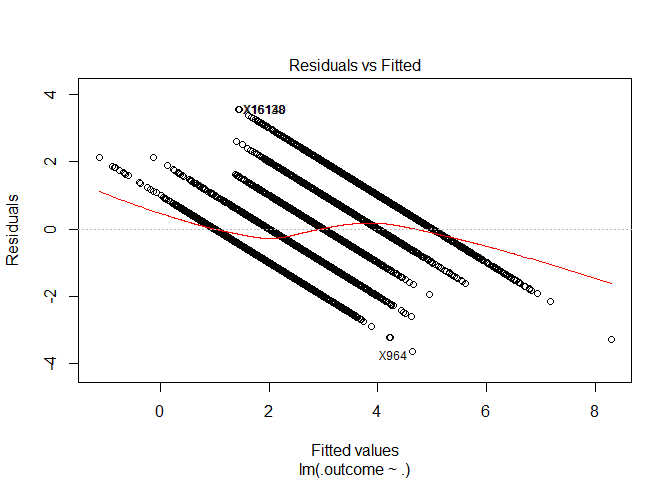
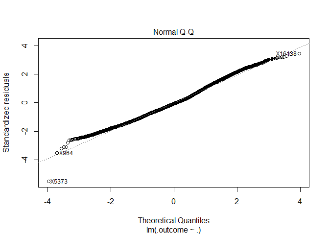
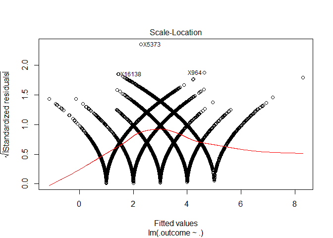
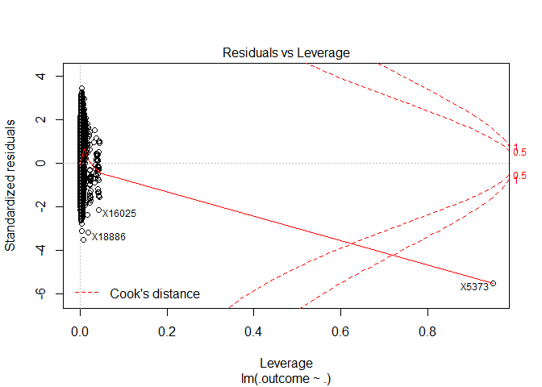
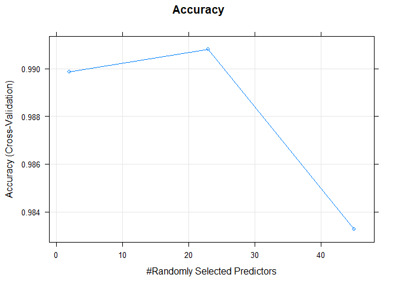
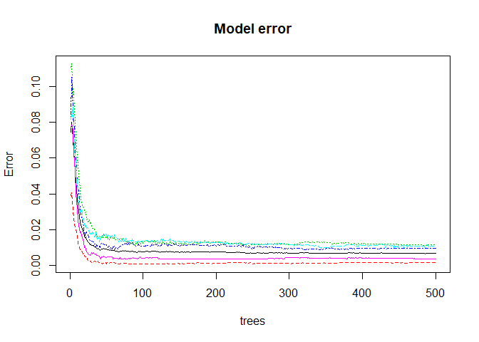

Practical Machine Learning Project
================
Aram Sethian
November 5, 2018

INTRODUCTION
============

One thing that people regularly do is quantify how much of a particular activity they do, but they rarely quantify how well they do it. In this project, your goal will be to use data from accelerometers on the belt, forearm, arm, and dumbell of 6 participants.

The following is an attempt to produce predictive models based on the Human Activity Recognition dataset (URL: <http://groupware.les.inf.puc-rio.br/har>). The goal is to accurately predict exercise classifications based on gyroscopic data collected from montoring devices. The exercise classifications are separated into the following: (A) exactly according to specification, (b) throwing elbows to the front, (C) lifting the dumbbell only halfway, (D) lowering the dumbbell only halfway, and (E) throwing hips to the front.

Preliminary work
----------------

We begin by importing the training and testing data. The training data is sub-set into training and validation sets to better predict out-of-sample error. There is some preliminary cleaning to do, namely removing mostly NA columns (&gt;95% of total) and variables that are not relevant to the model (subject, timestamps, windows).

``` r
training<-read.csv("https://d396qusza40orc.cloudfront.net/predmachlearn/pml-training.csv",na.strings=c("NA","#DIV/0!", ""))
testing<-read.csv("https://d396qusza40orc.cloudfront.net/predmachlearn/pml-testing.csv",na.strings=c("NA","#DIV/0!", ""))

##Cleaning the data set by removing variables >95% observations NA. Also removing irrelevant columns like subject and time stamps.
set.seed(11223)
cleantrain<-training[,-160]
cleantrain<-cleantrain[,colSums(is.na(cleantrain))<0.95*dim(cleantrain)[1]]
cleantrain<-cleantrain[,-c(1:7)]
cleantrain<-cbind(cleantrain,classe=training$classe)

cleantest<-testing[,names(cleantrain)[-53]]

## Creating a subset for training, testing sets.
inTrain<-createDataPartition(y=cleantrain$classe,p=0.7,list=FALSE)
cleantrain1<-cleantrain[inTrain,]
cleantrain2<-cleantrain[-inTrain,]
```

Preliminary Analysis
--------------------

The below further cleans the data set by looking for near zero variance variables with the nearZeroVar function, and for highly correlated variables with findCorrelation. There does not seem to be an issue with nil-variance variables, but there are 7 highly correlated variables that is removed from the set. PCA indicates that a high percentage of the data's variance can be explained by a subset of the data provided.

``` r
## near zero variance
nzv<-nearZeroVar(cleantrain1[,-53],saveMetrics=TRUE)
summary(nzv)
```

    ##    freqRatio      percentUnique      zeroVar           nzv         
    ##  Min.   : 1.000   Min.   : 0.2111   Mode :logical   Mode :logical  
    ##  1st Qu.: 1.043   1st Qu.: 2.0146   FALSE:52        FALSE:52       
    ##  Median : 1.083   Median : 4.6881                                  
    ##  Mean   : 5.789   Mean   :10.6306                                  
    ##  3rd Qu.: 1.189   3rd Qu.:10.8375                                  
    ##  Max.   :83.414   Max.   :86.6710

``` r
## correlated predictors
descrCor<-cor(cleantrain1[,-53])
highcorrs<-findCorrelation(descrCor,cutoff=0.9)
        ## features 10, 1, 9, 8, 31, 33, 18
cleantrain1<-cleantrain1[,-highcorrs]

cleantrain_pca<-preProcess(cleantrain1[,-53],method=c("center","scale","pca"))
cleantrain_pca
```

    ## Created from 13737 samples and 46 variables
    ## 
    ## Pre-processing:
    ##   - centered (45)
    ##   - ignored (1)
    ##   - principal component signal extraction (45)
    ##   - scaled (45)
    ## 
    ## PCA needed 25 components to capture 95 percent of the variance

Fitting a linear model
----------------------

We begin by fitting a simple linear model against all the variables. A linear model in this case seems to achieve an R^2 of 0.5098. The model doesn't seem appropriate here given the non-linearity of the data.

``` r
model1<-train(unclass(classe)~.,method="lm",data=cleantrain1)
finmodel1<-model1$finalModel
plot(finmodel1)
```



``` r
summary(finmodel1)
```

    ## 
    ## Call:
    ## lm(formula = .outcome ~ ., data = dat)
    ## 
    ## Residuals:
    ##     Min      1Q  Median      3Q     Max 
    ## -3.6355 -0.7016 -0.0695  0.6555  3.5552 
    ## 
    ## Coefficients:
    ##                        Estimate Std. Error t value Pr(>|t|)    
    ## (Intercept)           7.332e+00  4.780e-01  15.338  < 2e-16 ***
    ## pitch_belt            3.968e-02  1.888e-03  21.023  < 2e-16 ***
    ## yaw_belt             -2.386e-03  4.384e-04  -5.444 5.30e-08 ***
    ## total_accel_belt      1.091e-01  5.677e-03  19.219  < 2e-16 ***
    ## gyros_belt_x          1.744e-01  8.609e-02   2.025 0.042842 *  
    ## gyros_belt_y         -2.054e-01  2.295e-01  -0.895 0.370858    
    ## gyros_belt_z          2.218e-01  6.125e-02   3.621 0.000295 ***
    ## magnet_belt_x        -2.150e-03  4.985e-04  -4.313 1.62e-05 ***
    ## magnet_belt_y        -1.282e-02  5.865e-04 -21.866  < 2e-16 ***
    ## magnet_belt_z         1.337e-03  2.987e-04   4.477 7.64e-06 ***
    ## roll_arm             -2.032e-04  1.775e-04  -1.145 0.252362    
    ## pitch_arm            -4.578e-03  4.094e-04 -11.182  < 2e-16 ***
    ## yaw_arm               6.429e-04  1.493e-04   4.305 1.68e-05 ***
    ## total_accel_arm       1.277e-02  1.305e-03   9.784  < 2e-16 ***
    ## gyros_arm_y          -1.250e-01  1.300e-02  -9.613  < 2e-16 ***
    ## gyros_arm_z          -8.647e-02  2.586e-02  -3.344 0.000827 ***
    ## accel_arm_x           2.017e-04  2.628e-04   0.767 0.442886    
    ## accel_arm_y          -4.866e-03  4.719e-04 -10.312  < 2e-16 ***
    ## accel_arm_z           6.901e-03  2.872e-04  24.033  < 2e-16 ***
    ## magnet_arm_x         -3.598e-04  9.239e-05  -3.894 9.91e-05 ***
    ## magnet_arm_y         -1.281e-03  2.147e-04  -5.966 2.49e-09 ***
    ## magnet_arm_z         -9.988e-04  1.222e-04  -8.170 3.35e-16 ***
    ## roll_dumbbell         3.150e-03  2.476e-04  12.721  < 2e-16 ***
    ## pitch_dumbbell       -2.875e-03  5.294e-04  -5.429 5.75e-08 ***
    ## yaw_dumbbell         -5.581e-03  2.569e-04 -21.721  < 2e-16 ***
    ## total_accel_dumbbell  3.885e-02  2.574e-03  15.093  < 2e-16 ***
    ## gyros_dumbbell_y      1.157e-01  1.950e-02   5.935 3.02e-09 ***
    ## accel_dumbbell_x      7.285e-03  4.713e-04  15.458  < 2e-16 ***
    ## accel_dumbbell_y     -2.384e-04  4.276e-04  -0.558 0.577150    
    ## accel_dumbbell_z      9.042e-04  2.548e-04   3.549 0.000388 ***
    ## magnet_dumbbell_x    -3.478e-03  1.192e-04 -29.169  < 2e-16 ***
    ## magnet_dumbbell_y    -7.402e-04  1.116e-04  -6.631 3.46e-11 ***
    ## magnet_dumbbell_z     1.078e-02  1.810e-04  59.524  < 2e-16 ***
    ## roll_forearm          8.199e-04  1.058e-04   7.753 9.62e-15 ***
    ## pitch_forearm         1.032e-02  5.492e-04  18.787  < 2e-16 ***
    ## yaw_forearm          -1.696e-04  1.160e-04  -1.462 0.143791    
    ## total_accel_forearm   2.130e-02  1.201e-03  17.735  < 2e-16 ***
    ## gyros_forearm_x      -3.468e-02  2.519e-02  -1.377 0.168596    
    ## gyros_forearm_y       8.652e-03  7.073e-03   1.223 0.221267    
    ## gyros_forearm_z      -4.709e-02  1.092e-02  -4.311 1.64e-05 ***
    ## accel_forearm_x       9.221e-04  1.973e-04   4.674 2.98e-06 ***
    ## accel_forearm_y       9.795e-04  1.359e-04   7.209 5.91e-13 ***
    ## accel_forearm_z      -6.604e-03  1.511e-04 -43.717  < 2e-16 ***
    ## magnet_forearm_x     -8.591e-04  8.344e-05 -10.296  < 2e-16 ***
    ## magnet_forearm_y     -6.099e-04  5.476e-05 -11.137  < 2e-16 ***
    ## magnet_forearm_z      1.597e-04  5.165e-05   3.091 0.002000 ** 
    ## ---
    ## Signif. codes:  0 '***' 0.001 '**' 0.01 '*' 0.05 '.' 0.1 ' ' 1
    ## 
    ## Residual standard error: 1.033 on 13691 degrees of freedom
    ## Multiple R-squared:  0.5115, Adjusted R-squared:  0.5098 
    ## F-statistic: 318.5 on 45 and 13691 DF,  p-value: < 2.2e-16

Finding better predictive models
--------------------------------

Below, we also try to fit models using methods such as random forest, linear discriminant analysis, and stochastic gradient boosting. We see that the accuracy increases considerably, with RF at 0.9911, LDA at 0.677655, and gradient boosting at 0.957.

``` r
fitControl<-trainControl(method='cv', number=5,allowParallel=TRUE)
model2<-train(classe~.,data=cleantrain1,trControl=fitControl,method="rf")
model3<-train(classe~.,data=cleantrain1,trControl=fitControl,method="lda")
model4<-train(classe~.,data=cleantrain1,trControl=fitControl,method="gbm",verbose=FALSE)

print(model1)
```

    ## Linear Regression 
    ## 
    ## 13737 samples
    ##    45 predictor
    ## 
    ## No pre-processing
    ## Resampling: Bootstrapped (25 reps) 
    ## Summary of sample sizes: 13737, 13737, 13737, 13737, 13737, 13737, ... 
    ## Resampling results:
    ## 
    ##   RMSE     Rsquared   MAE      
    ##   1.06483  0.4827623  0.8258915
    ## 
    ## Tuning parameter 'intercept' was held constant at a value of TRUE

``` r
print(model2)
```

    ## Random Forest 
    ## 
    ## 13737 samples
    ##    45 predictor
    ##     5 classes: 'A', 'B', 'C', 'D', 'E' 
    ## 
    ## No pre-processing
    ## Resampling: Cross-Validated (5 fold) 
    ## Summary of sample sizes: 10990, 10990, 10988, 10990, 10990 
    ## Resampling results across tuning parameters:
    ## 
    ##   mtry  Accuracy   Kappa    
    ##    2    0.9898814  0.9871990
    ##   23    0.9908273  0.9883958
    ##   45    0.9832559  0.9788149
    ## 
    ## Accuracy was used to select the optimal model using the largest value.
    ## The final value used for the model was mtry = 23.

``` r
print(model3)
```

    ## Linear Discriminant Analysis 
    ## 
    ## 13737 samples
    ##    45 predictor
    ##     5 classes: 'A', 'B', 'C', 'D', 'E' 
    ## 
    ## No pre-processing
    ## Resampling: Cross-Validated (5 fold) 
    ## Summary of sample sizes: 10989, 10989, 10990, 10991, 10989 
    ## Resampling results:
    ## 
    ##   Accuracy   Kappa    
    ##   0.6772211  0.5912318

``` r
print(model4)
```

    ## Stochastic Gradient Boosting 
    ## 
    ## 13737 samples
    ##    45 predictor
    ##     5 classes: 'A', 'B', 'C', 'D', 'E' 
    ## 
    ## No pre-processing
    ## Resampling: Cross-Validated (5 fold) 
    ## Summary of sample sizes: 10990, 10990, 10989, 10989, 10990 
    ## Resampling results across tuning parameters:
    ## 
    ##   interaction.depth  n.trees  Accuracy   Kappa    
    ##   1                   50      0.7353877  0.6644639
    ##   1                  100      0.8076738  0.7565874
    ##   1                  150      0.8437809  0.8022874
    ##   2                   50      0.8482215  0.8077346
    ##   2                  100      0.9045645  0.8792281
    ##   2                  150      0.9298249  0.9112151
    ##   3                   50      0.8947365  0.8667266
    ##   3                  100      0.9388513  0.9226192
    ##   3                  150      0.9587975  0.9478710
    ## 
    ## Tuning parameter 'shrinkage' was held constant at a value of 0.1
    ## 
    ## Tuning parameter 'n.minobsinnode' was held constant at a value of 10
    ## Accuracy was used to select the optimal model using the largest value.
    ## The final values used for the model were n.trees = 150,
    ##  interaction.depth = 3, shrinkage = 0.1 and n.minobsinnode = 10.

Out of sample error
-------------------

Using the testing models on the training set below to check out of sample error.

``` r
pred1<-predict(model1,cleantrain2)
pred2<-predict(model2,cleantrain2)
pred3<-predict(model3,cleantrain2)
pred4<-predict(model4,cleantrain2)

confusionMatrix(pred2,cleantrain2$classe)$overall[1]
```

    ## Accuracy 
    ## 0.991164

``` r
confusionMatrix(pred3,cleantrain2$classe)$overall[1]
```

    ##  Accuracy 
    ## 0.6730671

``` r
confusionMatrix(pred4,cleantrain2$classe)$overall[1]
```

    ##  Accuracy 
    ## 0.9619371

Choosing a model
----------------

The most accurate model was trained with random forest. Note the model also implemented cross validation with 5 folds to limit overfitting.

``` r
plot(model2,main="Accuracy")
```



``` r
confusionMatrix(pred2,cleantrain2$classe)$table
```

    ##           Reference
    ## Prediction    A    B    C    D    E
    ##          A 1674   16    0    0    0
    ##          B    0 1117    8    0    0
    ##          C    0    6 1015    9    6
    ##          D    0    0    3  953    2
    ##          E    0    0    0    2 1074

``` r
plot(model2$finalModel,main="Model error")
```



Finally, we take a look at the most important variables.

``` r
MostImpVars<-varImp(model2)
print(MostImpVars)
```

    ## rf variable importance
    ## 
    ##   only 20 most important variables shown (out of 45)
    ## 
    ##                      Overall
    ## yaw_belt              100.00
    ## pitch_forearm          86.46
    ## pitch_belt             67.93
    ## magnet_dumbbell_z      62.94
    ## magnet_dumbbell_y      55.19
    ## roll_forearm           47.60
    ## magnet_belt_y          46.11
    ## magnet_belt_z          31.26
    ## gyros_belt_z           27.02
    ## roll_dumbbell          25.38
    ## accel_dumbbell_y       24.03
    ## magnet_dumbbell_x      23.87
    ## accel_forearm_x        23.09
    ## magnet_forearm_z       19.94
    ## accel_forearm_z        18.50
    ## magnet_belt_x          17.60
    ## accel_dumbbell_z       17.39
    ## total_accel_dumbbell   17.12
    ## total_accel_belt       16.02
    ## yaw_arm                15.72

CONCLUSION
==========

Though computationally intensive, the random forest model seems to best fit the data. Thus we apply model2 to predict the outcomes in the test set.

``` r
Test<-predict(model2,cleantest)
Test
```

    ##  [1] B A B A A E D B A A B C B A E E A B B B
    ## Levels: A B C D E
